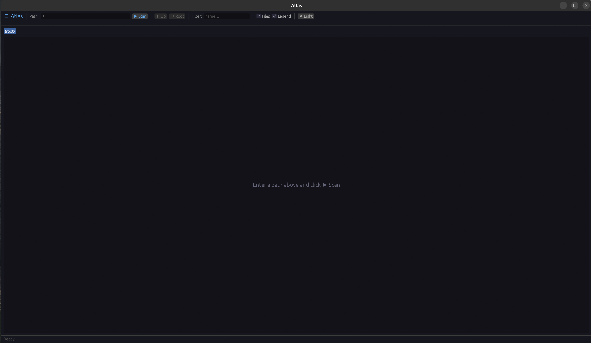
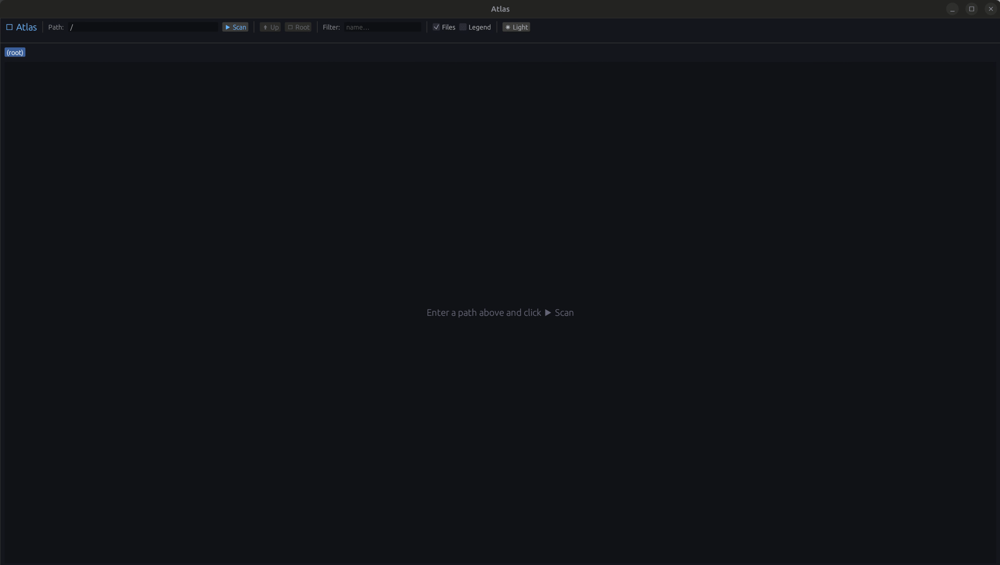
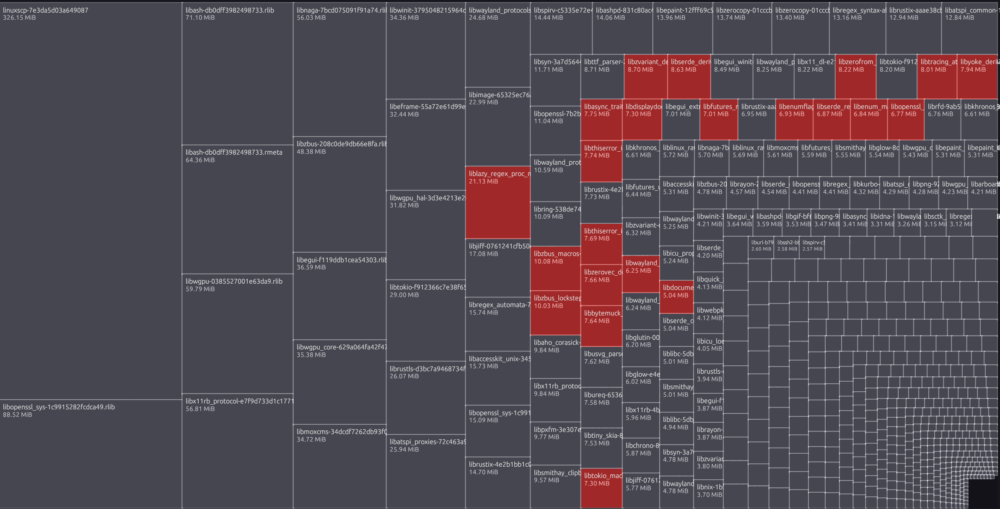

# Atlas

A native Linux disk space analyser with an interactive treemap visualisation — built in Rust.

Atlas shows you exactly where your disk space is going. Directories and files are represented as proportionally sized, colour-coded rectangles. Click any directory to zoom in; right-click to delete directly.

---

## Features

- **Live treemap during scan** — blocks appear and resize as directories are scanned; unscanned areas shown as animated placeholders
- **Free Space block** — the remaining free space on the filesystem is shown proportionally alongside your files
- **Click to zoom** — click any directory block to zoom in; use the breadcrumb bar, Up, or Root buttons to navigate back
- **Dark mode** (default) / light mode — toggle in the toolbar, persisted between sessions
- **11 colour-coded file categories** — Images, Video, Audio, Archives, Documents, Source Code, Executables, Fonts, Data, Directories, Other
- **Hover tooltips** — name, type, size, file count, last modified
- **Filter bar** — dims non-matching entries in real time
- **Right-click context menu** — open in file manager, copy path, delete with confirmation
- **Delete with confirmation** — removes files or whole directory trees; the treemap and free space update instantly without a rescan
- **Virtual filesystem aware** — `/proc`, `/sys`, `/dev`, cgroups and other pseudo-filesystems are automatically skipped when scanning `/`
- **No root required** — unreadable directories are silently skipped

---

## Screenshots

<table>
  <tr>
    <td></td>
    <td></td>
    <td></td>
  </tr>
</table>

---

## Installation

### Debian / Ubuntu (.deb)

```bash
# Download the latest release
wget https://github.com/ProfessorCam/atlas/releases/latest/download/atlas_0.1.0-1_amd64.deb

# Install
sudo apt install ./atlas_0.1.0-1_amd64.deb

# Run
atlas
```

### AppImage (portable, no install needed)

```bash
wget https://github.com/ProfessorCam/atlas/releases/latest/download/Atlas-0.1.0-x86_64.AppImage
chmod +x Atlas-0.1.0-x86_64.AppImage
./Atlas-0.1.0-x86_64.AppImage
```

---

## Build from source

**Requirements:** Rust 1.75+ (stable), a C compiler, and standard Linux development libraries.

```bash
git clone https://github.com/ProfessorCam/atlas.git
cd atlas
cargo build --release
./target/release/atlas
```

### Build the .deb package

```bash
cargo install cargo-deb   # one-time
./build-deb.sh
sudo apt install ./target/debian/atlas_*.deb
```

### Build the AppImage

```bash
./build-appimage.sh
```

The script downloads `appimagetool` automatically on first run.

---

## Usage

1. Type a path in the toolbar (defaults to your home directory) and click **▶ Scan**.
2. The treemap fills in as directories are scanned.
3. **Click** a directory block to zoom into it.
4. Use the **breadcrumb bar** at the top, **⬆ Up**, or **⌂ Root** to navigate back.
5. **Hover** any block to see details in the status bar and tooltip.
6. **Right-click** a block to open in file manager, copy the path, or delete it.
7. Use the **Filter** field to highlight entries by name.
8. Toggle **☾ Dark / ☀ Light** mode with the button in the top-right of the toolbar.

---

## Compatibility

| Distro | Status |
|--------|--------|
| Ubuntu 24.04 LTS | ✅ Tested |
| Ubuntu 26.04 LTS | ✅ Supported |
| Any x86-64 Linux | ✅ via AppImage |

---

## License

MIT — see [LICENSE](LICENSE).
