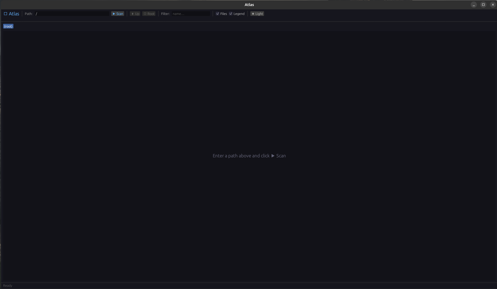
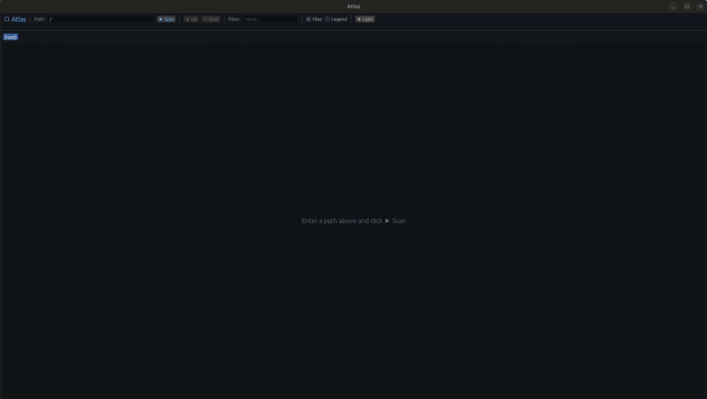
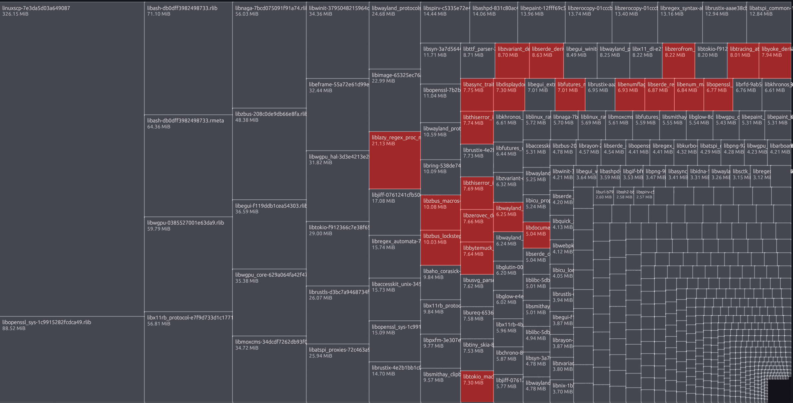

# Atlas

A native Linux disk space analyser with an interactive treemap visualization built in Rust.

Atlas shows you exactly where your disk space is going. Directories and files are represented as proportionally sized, colour-coded rectangles. Click any directory to zoom in; right-click to delete directly.

---

## Features

- **Nested treemap** — directories are drawn as boxes-within-boxes, SpaceSniffer-style, so you see the whole structure at a glance instead of one level at a time
- **Adjustable detail** — dial nesting depth up or down with the toolbar `+ / −` buttons, the `+ / −` keys, or the mouse wheel over the map
- **Auto-refresh** — the **Auto** checkbox (on by default) silently re-scans the current folder every 2 seconds, so files added or deleted on disk show up on the map without clicking Scan; your zoom and position are preserved and the old view stays on screen until fresh data is ready
- **Live treemap during scan** — blocks appear and resize as directories are scanned; unscanned areas shown as animated placeholders
- **Free Space block (toggleable)** — the remaining free space on the filesystem is shown proportionally alongside your files; hide it with the **Free** checkbox when you only care about the scanned folder
- **Click to zoom** — click any directory block (at any nesting level) to zoom in; use the breadcrumb bar, Up, Root, or `Backspace` / `Home` to navigate back
- **Advanced filter bar** — combine tokens (ANDed) to isolate what matters:
  - `report` — name contains "report"
  - `*.jpg` — files with a given extension
  - `type:image` (also `video`, `audio`, `archive`, `document`, `code`, `exe`, `dir`, …)
  - `>10mb` `<1gb` `>=500k` — size comparisons (units: `b`, `k`, `m`, `g`, `t`)
  - e.g. `type:video >200mb` — video files larger than 200 MiB
- **Dark mode** (default) / light mode — toggle in the toolbar, persisted between sessions
- **11 colour-coded file categories** — Images, Video, Audio, Archives, Documents, Source Code, Executables, Fonts, Data, Directories, Other
- **Hover tooltips** — name, type, size, file count, last modified
- **Keyboard shortcuts** — `Backspace` (up), `Home` (root), `+ / −` (detail), `F5` (re-scan)
- **Command-line path** — `atlas /some/dir` scans a folder on startup; `atlas --no-free-space /some/dir` hides the free-space block
- **Right-click context menu** — open in file manager, copy path, delete with confirmation
- **Delete with confirmation** — removes files or whole directory trees; the treemap and free space update instantly without a rescan
- **Virtual filesystem aware** — `/proc`, `/sys`, `/dev`, cgroups and other pseudo-filesystems are automatically skipped when scanning `/`
- **No root required** — unreadable directories are silently skipped

---

## Screenshots

<table>
  <tr>
    <td></td>
    <td></td>
    <td></td>
  </tr>
</table>

---

## Installation

### Debian / Ubuntu (.deb)

```bash
# Download the latest release
wget https://github.com/ProfessorCam/atlas/releases/latest/download/atlas_0.2.0-1_amd64.deb

# Install
sudo apt install ./atlas_0.2.0-1_amd64.deb

# Run
atlas
```

### Fedora / RHEL / openSUSE (.rpm)

```bash
wget https://github.com/ProfessorCam/atlas/releases/latest/download/atlas-0.2.0-1.x86_64.rpm
sudo dnf install ./atlas-0.2.0-1.x86_64.rpm   # or: sudo rpm -i atlas-0.2.0-1.x86_64.rpm
atlas
```

If the GUI libraries are missing, install them with:
`sudo dnf install gtk3 libxkbcommon mesa-libGL`.

### AppImage (portable, no install needed)

```bash
wget https://github.com/ProfessorCam/atlas/releases/latest/download/Atlas-0.2.0-x86_64.AppImage
chmod +x Atlas-0.2.0-x86_64.AppImage
./Atlas-0.2.0-x86_64.AppImage
```

---

## Build from source

**Requirements:** Rust 1.75+ (stable), a C compiler, and standard Linux development libraries.

```bash
git clone https://github.com/ProfessorCam/atlas.git
cd atlas
cargo build --release
./target/release/atlas
```

### Build the .deb package

```bash
cargo install cargo-deb   # one-time
./build-deb.sh
sudo apt install ./target/debian/atlas_*.deb
```

### Build the AppImage

```bash
./build-appimage.sh
```

The script downloads `appimagetool` automatically on first run.

---

## Usage

1. Type a path in the toolbar (defaults to your home directory) and click **▶ Scan** — or launch with `atlas /some/dir` to scan on startup.
2. The treemap fills in as directories are scanned, showing sub-directories nested inside their parents.
3. Adjust how deep the nesting goes with **Detail  − / +** (or the `+ / −` keys, or the mouse wheel over the map).
4. **Click** a directory block — at any nesting level — to zoom into it.
5. Navigate back with the **breadcrumb bar**, **⬆ Up** / **⌂ Root**, or the `Backspace` / `Home` keys.
6. **Hover** any block to see details in the status bar and tooltip.
7. **Right-click** a block to open in file manager, copy the path, or delete it.
8. Use the **Filter** field to isolate entries — by name, extension (`*.mp4`), type (`type:video`), or size (`>100mb`). Hover the field for the full syntax.
9. Leave **Auto** ticked to keep the map live (re-scans every 2 s), or untick it to freeze the current snapshot.
10. Toggle the **Free** space block, **Files**, and the **Legend** with their checkboxes; toggle **☾ Dark / ☀ Light** mode in the top-right.

---

## Compatibility

| Distro | Status |
|--------|--------|
| Ubuntu 24.04 LTS | ✅ Tested |
| Ubuntu 26.04 LTS | ✅ Supported |
| Any x86-64 Linux | ✅ via AppImage |

---

## License

MIT — see [LICENSE](LICENSE).
